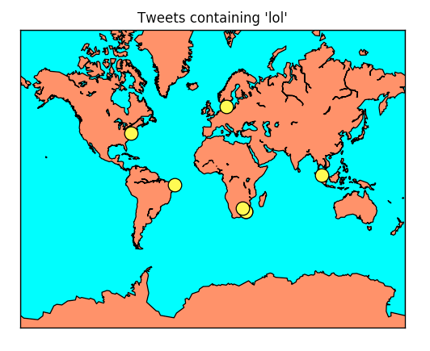

# miningtwitter
Multiple visualization tools for Twitter Analysis.

miningtwitter supports for now a wordcloud generator and a locator.

Make sure to use Python3

## Installation

Clone the git repository.

Install dependencies :

    pip install -r requirements.txt

## How to use

Generate access tokens from Twitter API (see https://dev.twitter.com/oauth/overview/application-owner-access-tokens)

Create a file config.py with the following form:
        
    consumer_key = ''
    consumer_secret = ''
    access_token = ''
    access_secret = ''

### Tweet Cloud Generator

In the 'twitter_cloud' directory, run the following command in a terminal:

    python tweet_cloud.py -q '*insert_request_here*'

Notes : 

* Mask and colors can be changed but they must have the same dimension.

#### Examples

Query = 'orange'

### Tweet Locator

In the 'twitter_location' directory, run the following command in a terminal:

    python tweet_map.py -q '*insert_request_here*'

#### Examples

Query = 'lol

Credits :

Wordcloud @amueller

Mining Twitter @marcobonzanini
